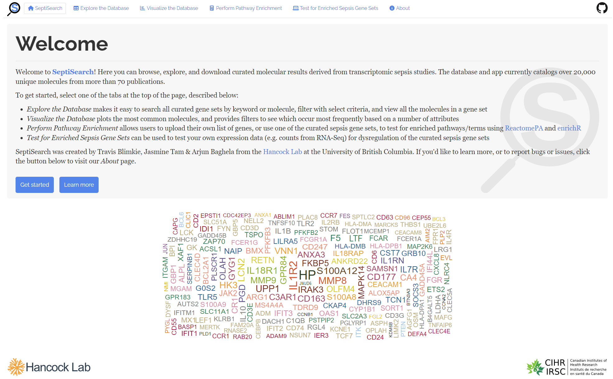

Welcome to SeptiSearch, an interactive Shiny app providing access to
manually-curated molecular sepsis data from current publications. Visit us 
at [septisearch.ca](https://septisearch.ca).

## Usage
The SeptiSearch app is designed to allow easy access to curated sepsis gene 
sets. Multiple tabs allow the exploration and use of the data in a number of 
ways:

- **Explore the Database** makes it easy to search all gene sets in the database
by keyword or molecule name, filter on a few general criteria, and view all the
molecules from a particular gene set(s)
- **Visualize the Database** displays the most common molecules in the database,
and provides filters to see which molecules are most common based on a number of
criteria (e.g. COVID studies)
- **Perform Pathway Enrichment** allows users to upload their own list of genes,
or choose one of the curated sepsis gene sets, and test for enriched
pathways/terms using ReactomePA and EnirchR
- **Test for Enriched Sepsis Gene Sets** can be used to test your own expression
data (e.g. counts from RNA-Seq) for dysregulation of the curated sepsis gene
sets

## Tutorial
For more details on how to use SeptiSearch, please see our tutorial hosted via 
Github pages:
https://hancockinformatics.github.io/SeptiSearch/

## Dependencies
SeptiSearch uses the following R packages:

- [Shiny](https://shiny.rstudio.com/)
- [ShinyJS](https://deanattali.com/shinyjs/)
- [DT](https://rstudio.github.io/DT/)
- [Tidyverse](https://www.tidyverse.org/)
- [Plotly](https://plotly.com/r/)
- [biomaRt](https://bioconductor.org/packages/biomaRt/)
- [ReactomePA](https://bioconductor.org/packages/ReactomePA)
- [enrichR](https://cran.r-project.org/package=enrichR)
- [GSVA](https://github.com/rcastelo/GSVA)
- [pheatmap](https://cran.r-project.org/package=pheatmap)

## Contributors
A big thank you to all of the SeptiSearch beta testers from the Hancock Lab:
Morgan Alford, Andy An, Melanie Dostert, Evan Haney, and Felix Santana.

Travis Blimkie is the main developer of the Shiny app. Jasmine Tam performed all
of the data gathering and curation, while Arjun Baghela served as the supervisor
for the project.

## License
This project uses the GNU General Public License v3.0, available
[here](https://github.com/hancockinformatics/SeptiSearch/blob/master/LICENSE).

 

